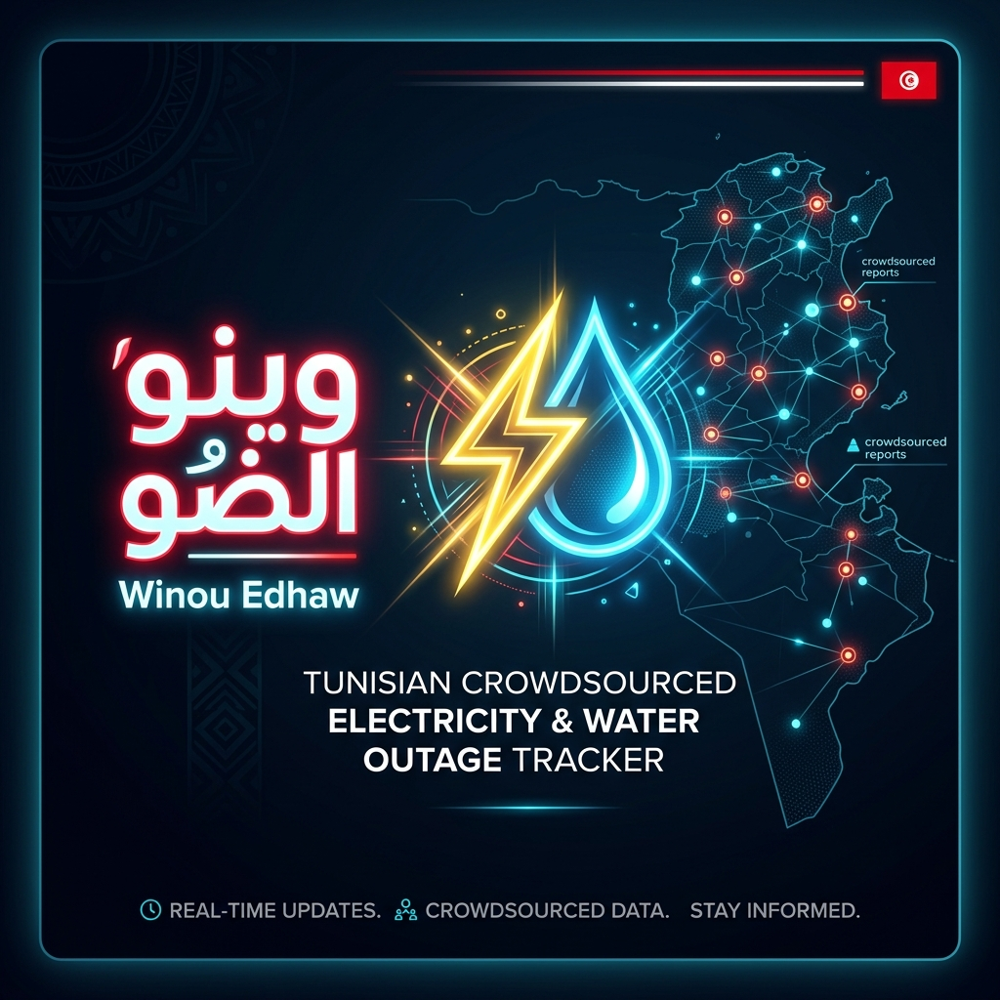

# ⚡ وينو الضو — Winou Edhaw 💧



> **Winou Edhaw (وينو الضو)** is a privacy-first, crowdsourced power and water outage tracker for Tunisia. Built with zero dependencies, it provides real-time community insights, an interactive dashboard, and a visual outage map to help citizens keep track of utility disruptions in their areas.

---

## 🌟 Key Features

### 1. ⏱️ 5-Second Quick Report Flow
- Citizens can report power (**ما فماش ضو / Pas de courant**) or water (**ما فماش ماء / Pas d'eau**) outages with a single tap.
- Option to add brief context notes (e.g., *"since 9 AM"*, *"water cut since yesterday"*).
- Instant feedback and queueing.

### 2. 🛡️ Privacy-First Location
- **GPS coordinates never leave the device.**
- Local coordination matches coordinates to the nearest delegation (district) entirely client-side.
- Only the generic region ID (e.g., `TN3151`) is sent to the server. No accounts or signup required.

### 3. 🗺️ Interactive Outage Map
- A fully responsive SVG map of Tunisian governorates.
- Dynamic color-coding reflects real-time status:
  - 🔴 **Confirmed Outage** (multiple reports from distinct devices)
  - 🟡 **Unconfirmed Outage** (recent singular reports)
  - 🟢 **Likely Restored** (silence or user confirmations indicating utilities are back)
- Hovering or clicking on a governorate shows detailed reports per delegation.

### 4. 🧠 Smart Clustering Engine
- An in-memory analytics engine parses raw, anonymous reports.
- Groups individual reports into active outage clusters using time-proximity algorithms (gaps $\le$ 90 mins).
- Resolves outages automatically when a threshold of users confirm utility restoration ("It's back!").

### 5. 📴 Offline-Ready PWA
- Fully offline functional via **Service Workers** (`sw.js`).
- Stores pending reports in local storage when offline and automatically flushes the queue as soon as the network returns.

### 6. 🌐 Bilingual Support (AR/FR)
- Seamless, instant toggle between **Tunisian Arabic (العربية)** and **French (Français)**.
- Localized notifications, dates, and search terms.

### 7. 🛡️ Advanced Anti-Spam & Rate-Limiting
- Server-side cryptographic device and IP hashing (utilizing a dynamic server-side salt).
- Prevents spamming and double-reports while allowing honest taps to succeed.
- Teleportation guard prevents a single device from reporting outages in multiple governorates within an hour.

---

## 🛠️ Technology Stack

| Layer | Technology | Details |
| :--- | :--- | :--- |
| **Backend** | **Node.js** | A pure, zero-dependency server handling static files, JSON APIs, and clustering logic. |
| **Frontend** | **Vanilla JS, HTML5, CSS3** | High-performance, lightweight design without bulky frameworks or bundlers. |
| **Styling** | **Vanilla CSS (Mobile-First)** | Ultra-fast dark mode optimized for low brightness during power outages. |
| **Data & Map** | **GeoJSON & Custom SVG** | Region datasets built from open-admin-data and geoBoundaries. |

---

## 📁 Directory Structure

```text
├── data/
│   ├── regions.json       # Tunisian delegations and governorates hierarchy
│   └── store.json         # Raw anonymous reports store (pruned after 48h)
├── public/
│   ├── app.js             # Core client application & i18n logic
│   ├── icon.svg           # Application logo
│   ├── index.html         # Main web page structure
│   ├── manifest.webmanifest # PWA configuration
│   ├── map-data.js        # Tunisian SVG map coordinates & shapes
│   ├── style.css          # Mobile-first CSS styling
│   ├── sw.js              # Service Worker for offline capabilities
│   └── winou_edhaw_banner.png # Beautiful app header banner
├── tools/
│   ├── build-map.js       # Developer tool to build Tunisian SVG maps from GeoJSON
│   ├── build-regions.js   # Regional database compiler
│   └── simulate.js        # Outage simulation tool to seed mock data
├── server.js              # Zero-dependency Node.js HTTP server
└── README.md              # Project Documentation
```

---

## 🚀 Getting Started

### 📋 Prerequisites
- **Node.js** (v16.0.0 or higher recommended)

### 1. Launch the Server
Clone the repository and run the Node.js server:
```bash
node server.js
```
The server will start on port `3000` by default. You can change the port using the `PORT` environment variable:
```bash
PORT=3001 node server.js
```

### 2. Seed Mock Outage Data (Developer Tool)
To test and visualize all cluster states (Confirmed, Unconfirmed, Likely Back, Water, Power) on the dashboard and map, run the simulation script in a separate terminal:
```bash
# Seed local server on port 3000
node tools/simulate.js

# Seed local server on a custom port
node tools/simulate.js http://localhost:3001
```

### 3. Open the App
Navigate to:
`http://localhost:3000` (or `http://localhost:3001` if a custom port was set).

---

## 🔒 Privacy & Security

- **Zero Tracker Logs**: No IP addresses or raw device identifiers are stored on the disk. All identification relies on a truncated SHA-256 hash using a unique random salt generated at server boot.
- **Client-Side Geolocation**: User coordinates are compared locally to delegation centroids. The server only knows the delegation ID.
- **Data Retention**: Outage reports are stored with a 48-hour retention window. Stale reports are automatically pruned.
